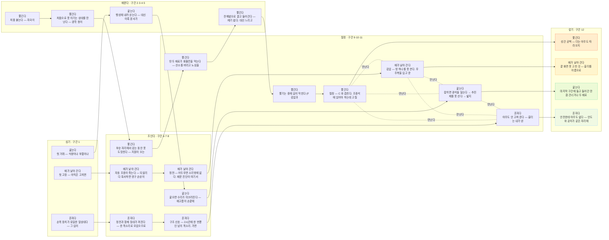

# 스토리 그물 — 줄기 넷이 서로를 당긴다

> ★★ **이 문서는 손으로 안 적습니다.**
> `web/space/js/game/story-table.js` 에서 `node tools/space-story.js --write` 로 뽑습니다.
> 손으로 고치면 다음에 뽑을 때 **지워집니다** — 고칠 것은 표입니다.
>
> 그림으로 그려 두면 반드시 잊힙니다. 코드가 바뀌어도 그림은 안 바뀌기
> 때문입니다. 그래서 표가 가리키는 것이 **정말 게임에 있나**를
> `space-story.js` 가 봅니다 — 장면을 지우거나 이름을 바꾸면 **빨개집니다.**

## 그물

## 줄기 넷

### 쫓긴다 — ★ 등뼈

> 내가 남기는 모든 것이 나를 가리킨다

| 구간 | | 무엇 | 있나 |
|---|---|---|---|
| 2 | 심기 | 처음 붙는다 — 「자국이 굵어집니다」 | ✔ |
| 4 | 조이기 | ★ 처음으로 **못 이기는 상대**를 만난다 — 광학 창이 「절망」이라고 적는다. 지나친다 | ✔ |
| 6 | 조이기 | ★★ 부순 자리에서 **감는 동안 못 도망친다** — 지원이 오는 소리를 들으며 줄을 감는다 | ✔ |
| 10 | 조이기 | ★★ 탄두 재료가 화물칸을 먹는다 — **산소를 버리고 노심을 싣는다** | ✔ |
| 5 | 조이기 | 잔해밭으로 끌고 들어간다 — 떼기 쉽다. 대신 느리고 부딪힌다 | ✔ |
| 9 | 조이기 | ★ 쫓기는 중에 **길이 막힌다** (F 감압과 겹친다) | ✔ |
| 11 | 조이기 | ★★ 절정 — C 와 겹친다. 조종석에 있어야 하는데 고칠 것은 밖에 있다 | ✔ |
| 12 | 갚기 | 성간 공백 — 「더는 아무도 따라오지 않습니다」 | ✔ |

**만난다** — 배가 낡아 간다 · 굶는다 · 혼자다

### 배가 낡아 간다

> 고칠 수 있는 것과 못 고치는 것이 갈린다

| 구간 | | 무엇 | 있나 |
|---|---|---|---|
| 1 | 심기 | 첫 고장 — 아직은 고치면 낫는다 | ✔ |
| 6 | 조이기 | ★ 자동 조종이 죽는다 — 되살리다 혹사하면 **영구 손상**이 남는다 | ✔ |
| 8 | 조이기 | ★ 정전 — 어두우면 **소리밖에 없다.** 배운 진단이 여기서 시험된다 | ✔ |
| 9 | 조이기 | ★ 감압 — **방 하나를 못 쓴다.** 우주복을 입고 문 너머로 들어간다 | ✔ |
| 12 | 갚기 | 끝 화면 「못 고친 것」 — 흉터를 이름으로 부른다 | ✔ |

**만난다** — 쫓긴다 · 굶는다 · 혼자다

### 굶는다

> 몸이 손으로 나온다

| 구간 | | 무엇 | 있나 |
|---|---|---|---|
| 1 | 심기 | 첫 거래 — 식량이냐 부품이냐 추진제냐 | ✔ |
| 3 | 조이기 | 행성에 내려 싣는다 — 대신 이륙 분사가 자국이다 | ✔ |
| 7 | 조이기 | ★ 굶으면 **수리가 미끄러진다** — 배고픔이 손끝에 온다 | ✔ |
| 10 | 조이기 | ★ 잡히면 광석을 잃는다 → 추진제를 못 산다 → **밟지 못하고 쫓긴다** | ✔ |
| 12 | 갚기 | ★ 마지막 구간에 **들고 들어간 만큼** 건너거나 두 배로 늘어진다 | ✔ |

**만난다** — 쫓긴다 · 배가 낡아 간다 · 혼자다

### 혼자다

> 이 배에 나 말고는 아무도 없다

| 구간 | | 무엇 | 있나 |
|---|---|---|---|
| 1 | 심기 | 손목 장치가 유일한 말상대다 — **그 입이 등대다** | ✔ |
| 8 | 조이기 | ★★ 정전과 함께 **등대가 꺼진다** — 한 목소리로 모았으므로 그 순간 **아무도 말하지 않는다** | ✔ |
| 7 | 조이기 | ★★ 구조 신호 — **2시간에 한 번뿐인 남의 목소리.** 가면 보급, 대신 자국과 시간 | ✔ |
| 11 | 조이기 | 아무도 안 고쳐 준다 — 흉터는 내가 낸 것이다 | ✔ |
| 12 | 갚기 | ★ 안전한데 아무도 없다 — 안도와 공허가 같은 자리에 온다 | ✔ |

**만난다** — 쫓긴다 · 배가 낡아 간다 · 굶는다

## 긴장의 모양

| 구간 | | |
|---|---|---|
| 1 | **심기** | 넷 다 처음 만난다. 아직 아무것도 안 아프다 |
| 2·3·4·5 | **배운다** | 한 번에 하나씩 값을 치른다 — 겹치지 않는다 |
| 6·7·8 | **조인다** | 흉터·구조 신호·정전. **못 고치는 것**이 처음 나온다 |
| 9·10·11 | **절정** | ★ 겹침 두 번이 여기다. 쫓기는 중에 길이 막히고 배가 돈다 |
| 12 | **갚기** | 넷이 한꺼번에 닫힌다 — 성간 공백과 끝 화면 |

## 계통 이름

| | |
|---|---|
| `sys:sign` | 자국 — 열·밸브·주포·바깥문·이륙·흉터가 전부 여기로 모인다 |
| `sys:scar` | 영구 손상 — 못 고친다. 우회한다 |
| `sys:trade` | 거점 거래 — 광석으로 식량과 부품을 산다 |
| `sys:caught` | 잡힘 — 광석을 잃는다 |
| `sys:shaky` | 굶주림 — 수리가 미끄러지고 화면이 떨린다 |
| `sys:wrist` | 손목 장치 — 지금 할 일과 고친 것 |
| `sys:fuel` | 추진제 — 밟는 동안 준다. 급가속·급기동이 크게 태운다. 바닥나면 관성으로만 간다 |
| `sys:suit` | 우주복 — 진공에 나가려면 입는다. 입으면 손이 둔하다 |
| `sys:void` | 성간 공백 — 마지막 구간. 벌 수도 잃을 수도 없다 |
| `sys:optic` | 광학 창 — 거리에 맞춰 저절로 당긴다. 배율 한도는 무기가 정한다. 격추 장면도 여기서 본다 |
| `sys:might` | 전투력 — 적의 것과 내 것을 견준다. 격추해서 무기·장갑을 회수하면 오른다 |
| `sys:salvage` | 회수 — 부순 자리에 꾸러미가 남는다. 그물로 감는 동안 못 나아가고, 지원이 온다 |
| `sys:cargo` | 화물 — 아이템 열여섯 · 무게 · 화물칸 100. 탄두를 다 모으면 꽉 찬다 |
| `sys:ai` | 등대 — 배가 말을 한다, 그러나 몰지는 않는다. 넷(배너·가르침·손목·F1)을 한 목소리로 |
| `sys:ending` | 끝 화면 — 「이렇게 왔다」 |

---

*이 문서는 `node tools/space-story.js --write` 가 뽑았습니다.*
